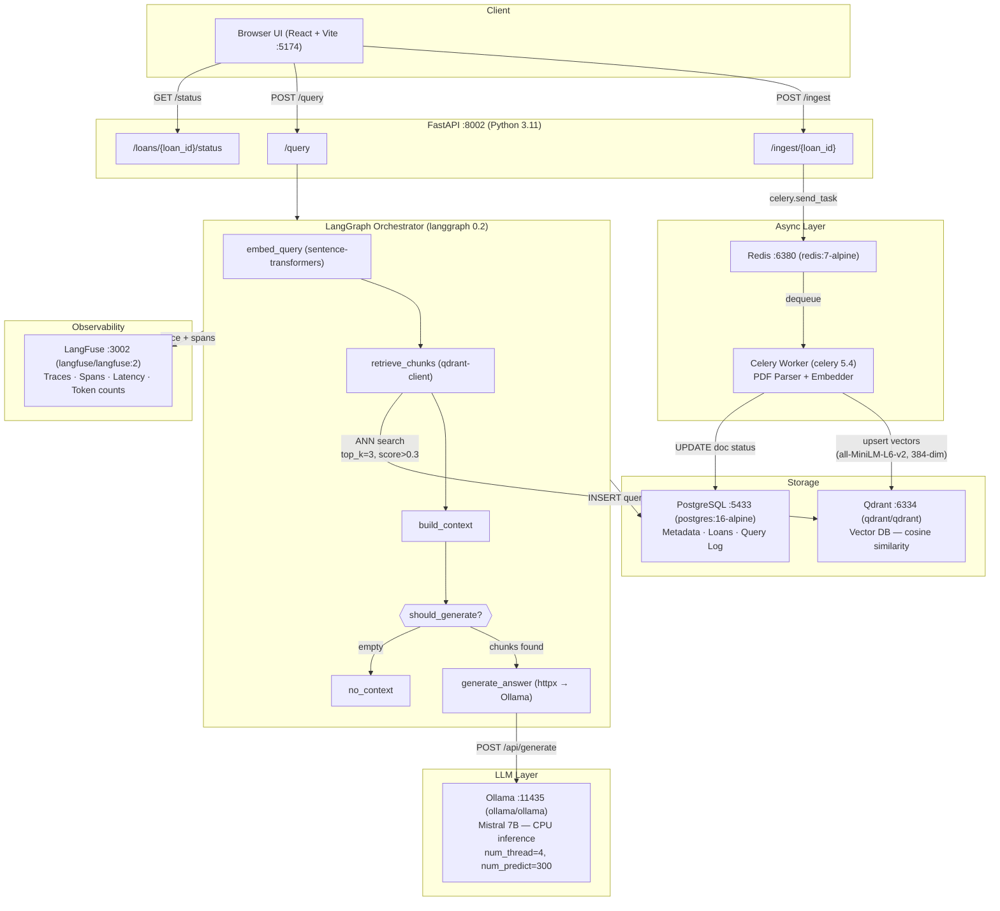
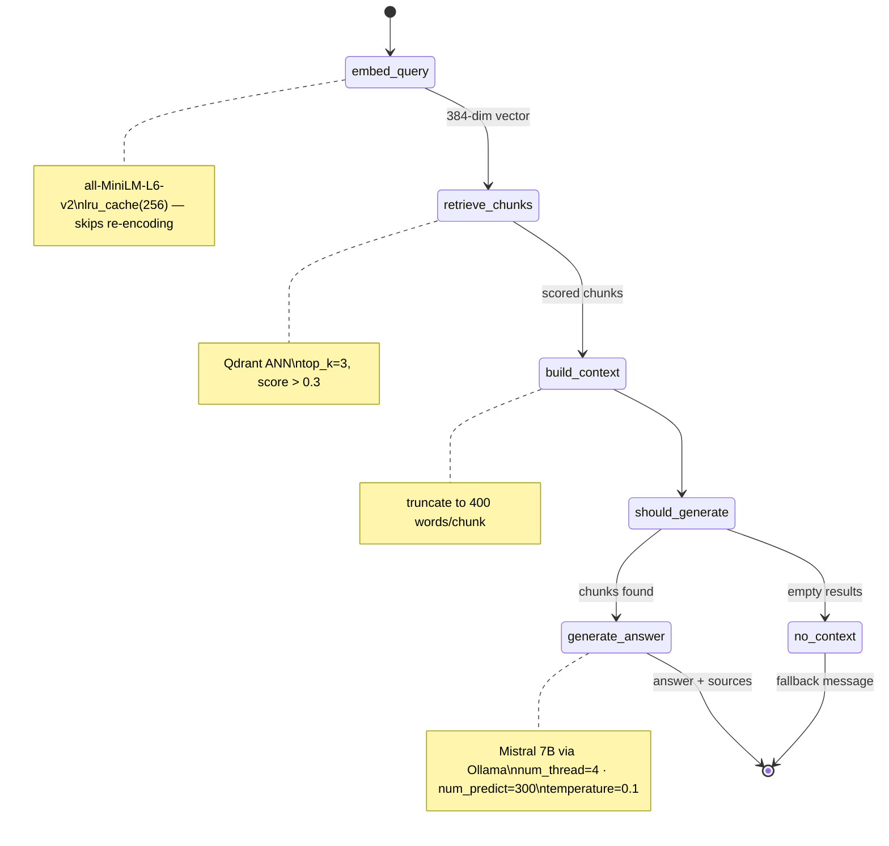
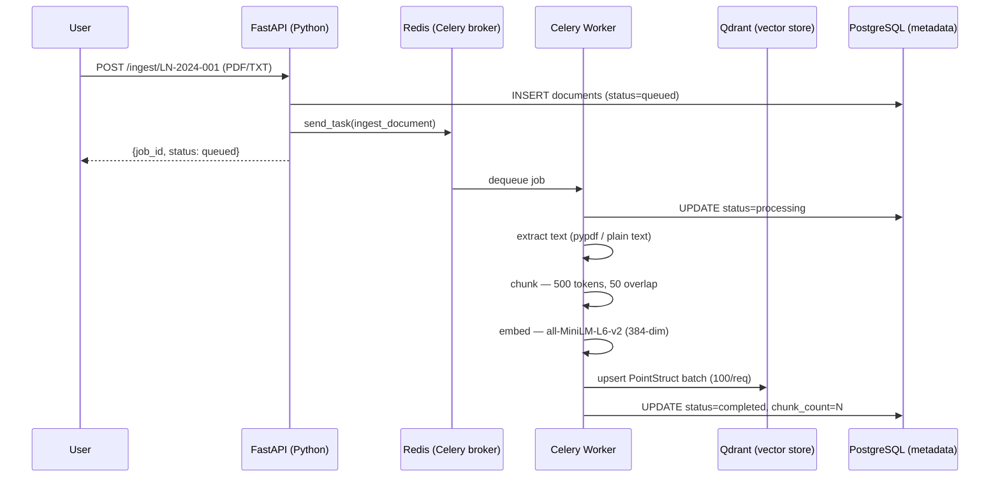
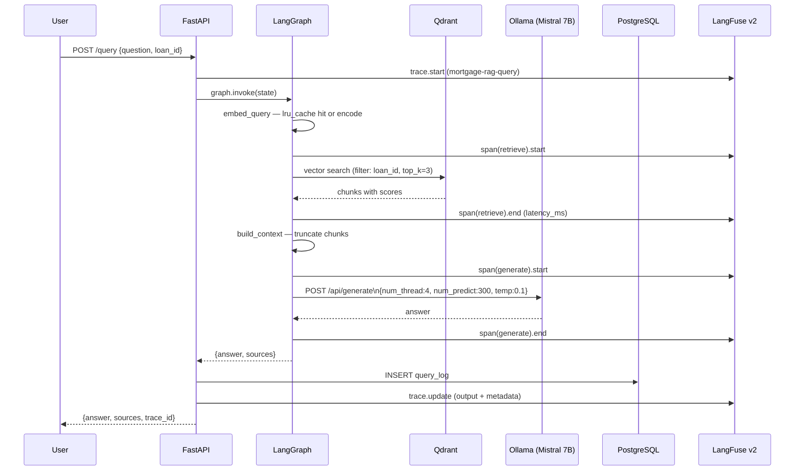
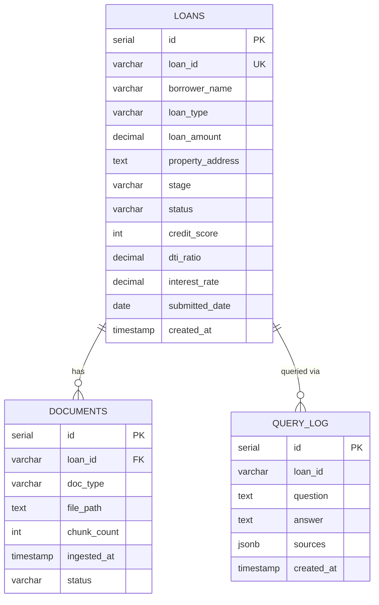
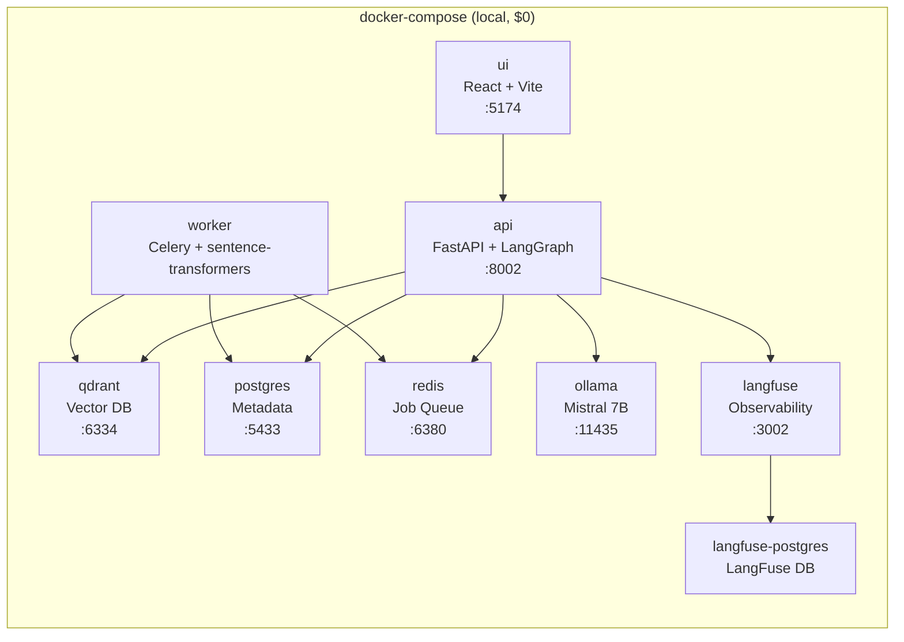

# Mortgage RAG Platform — Architecture

> **Developer Machine Only** — All services run locally via Docker Compose. No cloud infrastructure required.
> For cloud deployment see [Free Tier Migration](./cloud_migration_free_tier.md) → [Azure Stack](./azure_migration.md).

## System Overview

## LangGraph Query Pipeline

## Ingestion Pipeline

## Query Pipeline with Observability

## Data Model

## Docker Services

## Tech Stack Summary

| Layer | Technology | Version |
| --- | --- | --- |
| UI | React + Vite | React 18 |
| API | FastAPI + Uvicorn | 0.115 |
| Orchestration | LangGraph | 0.2.55 |
| Embeddings | sentence-transformers (all-MiniLM-L6-v2) | 3.1.1 |
| Vector DB | Qdrant | latest |
| LLM | Ollama + Mistral 7B | ollama:latest |
| Async Queue | Celery + Redis | 5.4 / redis:7 |
| Metadata DB | PostgreSQL | 16 |
| Observability | LangFuse v2 | langfuse:2 |
| PDF Parsing | pypdf | 4.3.1 |
| HTTP Client | httpx | 0.27.2 |
