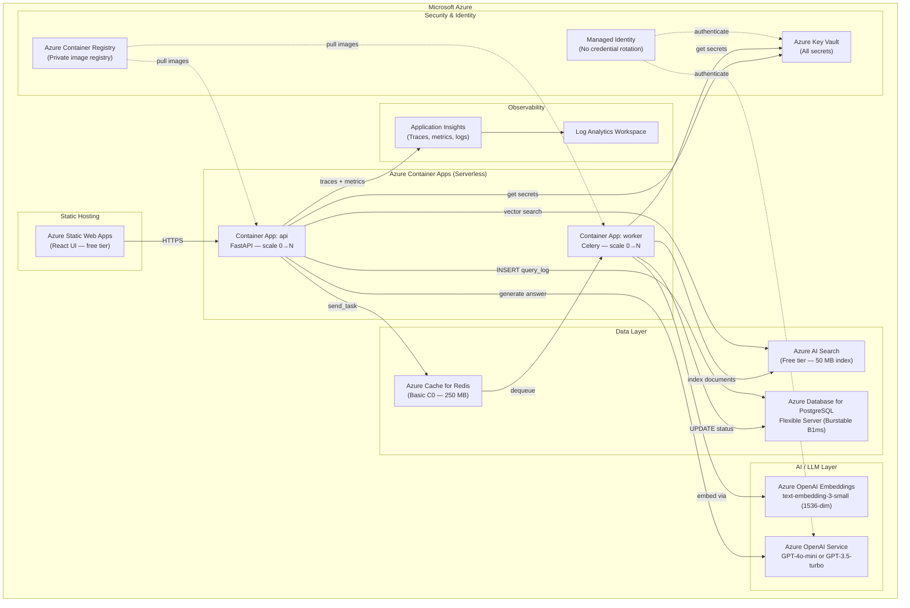

# Azure Stack Migration Guide

> **Previous step:** [Free tier cloud deployment](./cloud_migration_free_tier.md)
> **This step:** Enterprise-grade Azure deployment with managed services, security, and observability.

---

## Architecture: Free Cloud → Azure



---

## Service Mapping

| Local / Free Cloud | Azure Service | SKU (cost-optimized) | ~Monthly Cost |
|---|---|---|---|
| React UI (Vercel) | Azure Static Web Apps | Free tier | $0 |
| FastAPI (Railway) | Azure Container Apps | Serverless (pay per use) | ~$5–15 |
| Celery Worker (Railway) | Azure Container Apps | Serverless | ~$3–10 |
| Postgres (Neon) | Azure DB for PostgreSQL Flexible | Burstable B1ms | ~$15 |
| Redis (Upstash) | Azure Cache for Redis | Basic C0 | ~$16 |
| Qdrant Cloud | Azure AI Search | Free (50 MB) → Basic ($75) | $0–75 |
| Groq API | Azure OpenAI Service | Pay-per-token | ~$1–10 |
| LangFuse Cloud | Application Insights | Pay-per-GB (first 5 GB free) | $0–5 |
| Docker Hub | Azure Container Registry | Basic (~$5) | $5 |

**Estimated total: $40–130/month** depending on usage (vs. $0 POC on free tier)

---

## Key Architecture Changes vs. Free Tier

### 1. Qdrant → Azure AI Search

Azure AI Search replaces Qdrant for vector storage. It supports hybrid search (vector + keyword) natively.

**`worker/tasks.py` — indexing change:**

```python
from azure.search.documents import SearchClient
from azure.search.documents.indexes import SearchIndexClient
from azure.search.documents.indexes.models import (
    SearchIndex, SimpleField, SearchFieldDataType,
    SearchableField, VectorSearch, HnswAlgorithmConfiguration,
    VectorSearchProfile, SearchField
)
from azure.identity import DefaultAzureCredential

credential = DefaultAzureCredential()  # Uses Managed Identity in Azure

index_client = SearchIndexClient(
    endpoint=os.getenv("AZURE_SEARCH_ENDPOINT"),
    credential=credential,
)
search_client = SearchClient(
    endpoint=os.getenv("AZURE_SEARCH_ENDPOINT"),
    index_name="mortgage-docs",
    credential=credential,
)

# Upsert documents
search_client.upload_documents(documents=[{
    "id": chunk_id,
    "loan_id": loan_id,
    "doc_type": doc_type,
    "text": chunk_text,
    "embedding": embedding_vector,  # 1536-dim for text-embedding-3-small
}])
```

**`api/pipeline.py` — retrieval change:**

```python
from azure.search.documents.models import VectorizableTextQuery

results = search_client.search(
    search_text=None,
    vector_queries=[VectorizableTextQuery(
        text=state["question"],
        k_nearest_neighbors=state["top_k"],
        fields="embedding",
    )],
    filter=f"loan_id eq '{state['loan_id']}'",
    select=["id", "text", "loan_id", "doc_type"],
)
```

### 2. Groq / Ollama → Azure OpenAI Service

```python
from openai import AzureOpenAI

client = AzureOpenAI(
    azure_endpoint=os.getenv("AZURE_OPENAI_ENDPOINT"),
    api_version="2024-02-01",
    # No api_key needed — Managed Identity authenticates
    azure_ad_token_provider=get_bearer_token_provider(
        DefaultAzureCredential(), "https://cognitiveservices.azure.com/.default"
    ),
)

completion = client.chat.completions.create(
    model=os.getenv("AZURE_OPENAI_DEPLOYMENT", "gpt-4o-mini"),
    messages=[{"role": "user", "content": prompt}],
    max_tokens=300,
    temperature=0.1,
)
answer = completion.choices[0].message.content.strip()
```

### 3. all-MiniLM-L6-v2 → Azure OpenAI Embeddings

```python
# worker/tasks.py
emb_client = AzureOpenAI(
    azure_endpoint=os.getenv("AZURE_OPENAI_ENDPOINT"),
    api_version="2024-02-01",
)

response = emb_client.embeddings.create(
    model="text-embedding-3-small",  # 1536-dim
    input=chunk_text,
)
vector = response.data[0].embedding
```

> **Note:** Update Qdrant/AI Search collection from 384-dim to 1536-dim when switching.

### 4. Hardcoded Env Vars → Azure Key Vault

All secrets stored in Key Vault; API and Worker read via Managed Identity (no credentials in code):

```python
from azure.keyvault.secrets import SecretClient
from azure.identity import DefaultAzureCredential

kv = SecretClient(
    vault_url=os.getenv("AZURE_KEY_VAULT_URL"),
    credential=DefaultAzureCredential(),
)

POSTGRES_URL = kv.get_secret("postgres-url").value
```

Or use **Key Vault references in Container Apps** (no code change needed):
```yaml
# Container App environment variable
POSTGRES_URL: "@Microsoft.KeyVault(SecretUri=https://kv-mortgage.vault.azure.net/secrets/postgres-url/)"
```

### 5. LangFuse → Application Insights

```python
from azure.monitor.opentelemetry import configure_azure_monitor
from opentelemetry import trace

configure_azure_monitor(
    connection_string=os.getenv("APPLICATIONINSIGHTS_CONNECTION_STRING")
)
tracer = trace.get_tracer(__name__)

with tracer.start_as_current_span("mortgage-rag-query") as span:
    span.set_attribute("loan_id", loan_id)
    span.set_attribute("question", question)
    result = graph.invoke(state)
    span.set_attribute("chunk_count", len(result["chunks"]))
```

---

## Infrastructure as Code (Bicep)

Provision core resources in one command:

```bicep
// main.bicep
param location string = 'eastus'
param projectName string = 'mortgage-rag'

resource kv 'Microsoft.KeyVault/vaults@2023-07-01' = {
  name: '${projectName}-kv'
  location: location
  properties: {
    sku: { family: 'A', name: 'standard' }
    tenantId: subscription().tenantId
    enableRbacAuthorization: true
  }
}

resource postgres 'Microsoft.DBforPostgreSQL/flexibleServers@2023-06-01-preview' = {
  name: '${projectName}-pg'
  location: location
  sku: { name: 'Standard_B1ms', tier: 'Burstable' }
  properties: {
    storage: { storageSizeGB: 32 }
    version: '16'
  }
}

resource redis 'Microsoft.Cache/redis@2023-08-01' = {
  name: '${projectName}-redis'
  location: location
  properties: { sku: { name: 'Basic', family: 'C', capacity: 0 } }
}

resource search 'Microsoft.Search/searchServices@2023-11-01' = {
  name: '${projectName}-search'
  location: location
  sku: { name: 'free' }
}
```

Deploy:
```bash
az deployment group create \
  --resource-group rg-mortgage-rag \
  --template-file infra/main.bicep
```

---

## CI/CD with GitHub Actions

```yaml
# .github/workflows/deploy.yml
name: Deploy to Azure

on:
  push:
    branches: [main]

jobs:
  build-and-deploy:
    runs-on: ubuntu-latest
    steps:
      - uses: actions/checkout@v4

      - name: Log in to Azure Container Registry
        uses: azure/docker-login@v1
        with:
          login-server: ${{ secrets.ACR_LOGIN_SERVER }}
          username: ${{ secrets.ACR_USERNAME }}
          password: ${{ secrets.ACR_PASSWORD }}

      - name: Build and push API image
        run: |
          docker build -t ${{ secrets.ACR_LOGIN_SERVER }}/mortgage-api:${{ github.sha }} ./api
          docker push ${{ secrets.ACR_LOGIN_SERVER }}/mortgage-api:${{ github.sha }}

      - name: Update Container App
        uses: azure/container-apps-deploy-action@v1
        with:
          resourceGroup: rg-mortgage-rag
          containerAppName: ca-mortgage-api
          imageToDeploy: ${{ secrets.ACR_LOGIN_SERVER }}/mortgage-api:${{ github.sha }}
```

---

## Security Enhancements (Enterprise)

These items from the [enterprise review](./requirements.md#out-of-scope) become mandatory on Azure:

| Item | Azure Implementation |
|---|---|
| API Authentication | Azure AD / Entra ID — MSAL JWT validation |
| RBAC | Azure AD App Roles (Underwriter, Auditor, Admin) |
| Secrets | Azure Key Vault + Managed Identity |
| Audit Logging | Azure Monitor Diagnostic Logs → Log Analytics |
| Network Isolation | Virtual Network + Private Endpoints for Postgres, Redis, Search |
| TLS everywhere | Azure manages certs; Container Apps enforce HTTPS |
| Rate Limiting | Azure API Management (APIM) in front of Container Apps |
| PII Protection | Azure Purview data classification |

---

## Migration Checklist

### Pre-Migration
- [ ] Azure subscription with Contributor role
- [ ] Resource group `rg-mortgage-rag` created
- [ ] Azure CLI installed and logged in (`az login`)

### Infrastructure
- [ ] Key Vault provisioned, secrets uploaded
- [ ] PostgreSQL Flexible Server provisioned, `init.sql` applied
- [ ] Azure Cache for Redis provisioned
- [ ] Azure AI Search provisioned, index schema created
- [ ] Azure OpenAI Service provisioned, deployments created (`gpt-4o-mini`, `text-embedding-3-small`)
- [ ] Application Insights + Log Analytics Workspace created
- [ ] Azure Container Registry created

### Code Changes
- [ ] `api/pipeline.py` — replace Ollama with Azure OpenAI
- [ ] `worker/tasks.py` — replace sentence-transformers + Qdrant with Azure OpenAI Embeddings + AI Search
- [ ] `api/main.py` — replace psycopg2 direct with SQLAlchemy pool
- [ ] Add `DefaultAzureCredential` everywhere (removes hardcoded secrets)
- [ ] Add Application Insights OpenTelemetry tracing
- [ ] Update `requirements.txt` for both `api/` and `worker/`

### Deployment
- [ ] Docker images built and pushed to ACR
- [ ] Container Apps created (api, worker) with Managed Identity
- [ ] Static Web App created, UI deployed
- [ ] GitHub Actions workflow configured
- [ ] End-to-end query test on Azure endpoints
- [ ] LangFuse / AppInsights traces verified

---

## Cost Optimization Tips

1. **Scale to zero** — Container Apps bill only when processing; set `minReplicas: 0`
2. **PostgreSQL schedule** — Use Burstable tier; pause during off-hours with Azure Automation
3. **AI Search Free tier** — Sufficient for POC (50 MB); upgrade to Basic only if needed
4. **GPT-4o-mini** — 15× cheaper than GPT-4o; adequate for factual mortgage queries
5. **text-embedding-3-small** — Cheapest embedding model; 1536-dim still outperforms MiniLM
6. **Reserved capacity** — If running 24/7, 1-year reservation saves ~40% on Postgres and Redis
